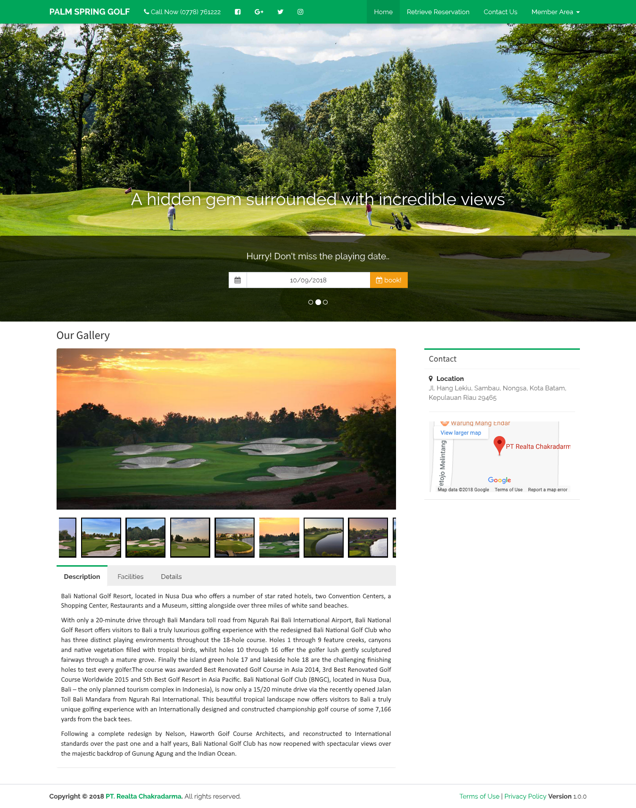

# **Welcome to Golf Course User Guide**

 

## Introduction

 

<quote>Home</quote>

 

**Bali National Golf Resort**, located in Nusa Dua who offers a number of star rated hotels, two Convention Centers, a Shopping Center, Restaurants and a Museum, sitting alongside over three miles of white sand beaches. With only a _20-minute_ drive through Bali Mandara toll road from Ngurah Rai Bali International Airport, Bali National Golf Resort offers visitors to Bali a truly luxurious golfing experience with the redesigned Bali National Golf Club who has three distinct playing environments throughout the 18-hole course.  

Holes 1 through 9 feature creeks, canyons and native vegetation filled with tropical birds, whilst holes 10 through 16 offer the golfer lush gently sculptured fairways through a mature grove. Finally the island green hole 17 and lakeside hole 18 are the challenging finishing holes to test every golfer. 

&#160;

 

The course was awarded _"Best Renovated Golf Course in Asia 2014"_, _"3rd Best Renovated Golf Course Worldwide 2015"_ and _"5th Best Golf Resort in Asia Pacific"_. Bali National Golf Club (BNGC), located in Nusa Dua, Bali – the only planned tourism complex in Indonesia), is now only a 15/20 minute drive via the recently opened Jalan Toll Bali Mandara from Ngurah Rai International.   

This beautiful tropical landscape now offers visitors to Bali a truly unique golfing experience with an Internationally designed and constructed championship golf course of some 7,166 yards from the back tees. Following a complete redesign by Nelson, Haworth Golf Course Architects, and reconstructed to International standards over the past one and a half years, Bali National Golf Club has now reopened with spectacular views over the majestic backdrop of Gunung Agung and the Indian Ocean.

 
